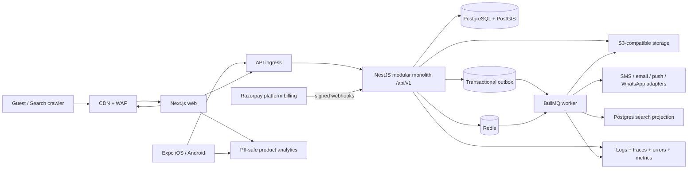

# WedConnect — Module 0: Discovery and Planning

**Status:** Proposed for approval  
**Date:** 14 August 2026  
**Scope:** Planning only. No production feature code has been created.

## 1. Repository assessment

The supplied workspace is empty apart from `work/` and `outputs/`. It is not a Git repository and contains no source code, package manifests, schemas, migrations, tests, CI configuration, infrastructure definitions, secrets templates, or repository-level instructions.

Consequences:

- WedConnect is a greenfield implementation.
- There is no legacy architecture or data migration constraint to preserve.
- Module 1 must initialize Git, the pnpm/Turborepo workspace, applications, shared packages, local infrastructure, CI, and baseline documentation.
- No existing implementation can be certified, tested, or reused at this stage.

## 2. Assumptions

These assumptions are proposed defaults and require confirmation where marked as decisions in section 18.

### Product and market

- Initial launch territory is Coimbatore city and representative localities in Coimbatore district; the data model remains India-wide.
- English and Tamil are the initial content languages. English is the canonical SEO language for MVP; Tamil localization can be phased in without changing URLs initially.
- One account may hold multiple roles, but a single active context is selected in each UI session.
- A vendor business may have multiple members and categories but one primary category and one primary city.
- Public prices are indicative only (for example, “starting at” or a range), never a booking quote.
- Customer–vendor contracts and wedding-service payments occur entirely outside WedConnect.

### Identity, consent, and trust

- India mobile OTP is the primary customer/vendor login method. Email is optional for those roles; administrators use email/password plus TOTP MFA.
- An OTP provider adapter is required so providers can be changed. Development uses a non-production local adapter that never ships enabled in production.
- Contact details are private by default and disclosed per vendor, per requirement/enquiry, against an immutable versioned consent record.
- Verification evidence is private, separately authorized, encrypted, retained by policy, and never delivered through the public media CDN.

### Commercial and operational

- Razorpay processes only platform purchases: plans, lead credits, verification fees, and promotions.
- All money is stored as integer minor units with ISO currency code; initial currency is INR.
- Taxes, invoicing, plan eligibility, credit expiry, and refunds are configurable policies reviewed by Indian legal/tax counsel.
- Sponsored placement is a separate candidate stream and never modifies organic scores silently.

### Technical

- Modular monolith: one NestJS deployable API and one worker deployable, sharing domain packages and one PostgreSQL database.
- PostgreSQL is the system of record; PostGIS, `pg_trgm`, and full-text search serve MVP discovery.
- Redis supports BullMQ, rate limits, short-lived caches, OTP state, and distributed locks; it is not authoritative storage.
- S3-compatible object storage uses separate public-derived-media and private-evidence boundaries.
- Production runs in one Indian region initially with a CDN; disaster recovery uses encrypted backups in a separate failure domain.
- API dates use UTC ISO 8601; user-facing dates use the selected locale/time zone. Event dates also preserve the wedding locality’s time-zone context.
- UUIDv7 is preferred for new identifiers if Prisma/database support is validated; otherwise UUIDv4.

## 3. Clarifying questions that materially affect architecture

1. Which organization will own production cloud, DNS, Apple/Google developer accounts, Razorpay, SMS/WhatsApp, email, Sentry, and analytics accounts?
2. Must customer/vendor authentication be mobile-OTP-only, or are email/social login and password recovery required at launch?
3. Are English and Tamil both launch requirements, including vendor-entered content and moderation, or is Tamil post-MVP?
4. Can a person own or work for multiple vendor businesses, and may one business operate multiple public branches/brands?
5. What precisely makes a review eligible: enquiry/contact reveal alone, vendor acknowledgement, uploaded evidence, or moderator approval?
6. What is the commercial lead rule: charge on unlock, on response, or on contact reveal; how many vendors may unlock each lead; and when is an automatic refund permitted?
7. Which verification documents may be collected, which verification provider is approved, and what are their retention periods? Government-ID handling should not begin without counsel-approved policy.
8. Which payment cases need GST invoices, credit notes, partial refunds, plan upgrades/downgrades, and auto-renewal?
9. Which notification providers and WhatsApp Business templates are approved, and are WhatsApp messages transactional-only at launch?
10. What moderation service-level targets, escalation paths, and operating hours apply to reports, verification, grievances, copyright claims, and appeals?
11. What are the approved retention windows for inactive accounts, enquiries, consent records, audit logs, media, verification evidence, and billing records?
12. What launch traffic, media volume, OTP rate, enquiry volume, recovery objectives (RPO/RTO), and monthly infrastructure budget should capacity planning target?
13. Is web customer/vendor functionality required to reach full parity with mobile at launch, or may selected workflows be mobile-first?
14. Who is the data-protection/grievance contact, and which counsel will approve DPDP Act, consumer, intermediary, tax, advertising, and marketplace language?

## 4. Confirmed business boundaries

WedConnect is an information, discovery, portfolio, lead-generation, and introduction platform. It is not a wedding-service booking or payment intermediary.

The platform may facilitate requests, availability checks, enquiries, consented contact reveal, calls, and WhatsApp contact. It may charge vendors for platform subscriptions, lead credits, verification fees, and disclosed promotions.

It must not collect or hold wedding-service funds, take vendor-service advances, provide escrow or settlement, confirm bookings, earn wedding booking commission, become a party to customer–vendor contracts, guarantee quality/safety/conduct, or administer vendor cancellation refunds.

Required disclaimer:

> WedConnect helps users discover and connect with independent wedding professionals. Prices, contracts, payments, cancellations and service delivery are agreed directly between customers and vendors. WedConnect does not confirm or guarantee the engagement.

Product copy and analytics taxonomies must prohibit “Book Now,” “Booking Confirmed,” “Pay Advance,” “Guaranteed Vendor,” “100% Safe,” “Secure Booking,” and “WedConnect Protection.” A CI copy-policy test should scan owned UI strings for prohibited language.

## 5. Proposed monorepo structure

```text
wedconnect/
├── apps/
│   ├── web/                 # Next.js public, customer, vendor, admin surfaces
│   ├── mobile/              # Expo Router role-aware iOS/Android app
│   ├── api/                 # NestJS modular monolith and OpenAPI
│   └── worker/              # BullMQ processors and scheduled jobs
├── packages/
│   ├── api-client/          # generated typed client; no handwritten drift
│   ├── domain-types/        # shared enums, DTO-safe primitives, event contracts
│   ├── validation/          # Zod schemas shared by web/mobile where appropriate
│   ├── business-rules/      # pure policy and eligibility functions
│   ├── design-tokens/       # platform-neutral colors, type, spacing, motion
│   ├── analytics/           # typed, PII-safe event schema
│   ├── web-ui/              # accessible web components
│   ├── mobile-ui/           # accessible native components
│   ├── config/              # eslint, tsconfig, prettier, env validation
│   └── testing/             # factories, fixtures, test helpers
├── infrastructure/
│   ├── docker/              # local Postgres/PostGIS, Redis, object storage
│   ├── terraform/           # production cloud resources after provider approval
│   └── observability/       # collectors, dashboards, alerts
├── documentation/
│   ├── architecture/
│   ├── api/
│   ├── data/
│   ├── security/
│   ├── privacy/
│   ├── operations/
│   └── adr/                 # architecture decision records
├── scripts/
├── .github/workflows/
├── pnpm-workspace.yaml
├── turbo.json
└── package.json
```

Dependency rules: apps may import packages; domain packages may not import apps or UI; API domain modules do not import transport controllers; generated clients derive from OpenAPI; cross-domain writes use application services and transactional outbox events, not direct table access from other modules.

## 6. Domain-module map

| Domain group | Modules | Primary responsibility |
|---|---|---|
| Access | Identity, Users, Roles & Permissions, Sessions | Authentication, RBAC, object scope, revocation, admin MFA |
| Privacy | Consent, Privacy Requests, Retention | Versioned consent, contact disclosure, export/deletion/correction |
| Marketplace foundation | Locations, Taxonomy | Geographic hierarchy, service areas, categories, dynamic field definitions |
| Vendor supply | Vendor Businesses, Members, Services, Packages, Availability | Onboarding, team grants, catalog, prices, capacity guidance |
| Content | Media, Portfolios | Upload lifecycle, derived assets, rights declaration, publication |
| Discovery | Discovery, Search | eligibility, organic rank, filters, sponsored insertion abstraction |
| Demand and connection | Requirements, Enquiries, Leads | customer intent, matching, lead access, response, status |
| Customer organization | Shortlists, Comparison | saves, notes, adaptive comparison, read-only share |
| Trust and safety | Reviews, Verification, Moderation, Reports, Grievances, Appeals | interaction evidence, scoped badges, case decisions and escalation |
| Monetization | Plans, Subscriptions, Credits, Promotions, Invoices | platform billing, immutable ledger, disclosed sponsorship |
| Engagement | Notifications | channel preferences, quiet hours, retries, delivery logs |
| Governance | Analytics, Audit Logs, Platform Configuration | PII-safe events, immutable admin trail, flags and settings |
| Platform | Outbox, Idempotency, Health | reliable async delivery, replay protection, readiness/liveness |

Each module owns its tables and exposes application interfaces. Cross-cutting authorization is policy-based but resource ownership checks remain in the owning module.

## 7. System architecture



### Architectural decisions

- Public SEO pages are server-rendered and cached only for approved public records. Authenticated/private data is never placed in shared caches.
- API is REST under `/api/v1`; OpenAPI is the contract source for generated web/mobile clients.
- Mutations that cause asynchronous work write domain state and an outbox record in one database transaction. A dispatcher publishes idempotent BullMQ jobs; consumers track processed event IDs.
- Search uses a provider interface. MVP implementation uses PostgreSQL FTS, trigram similarity, PostGIS, and indexed normalized filters. OpenSearch can later implement the same query/result contracts.
- Uploads use short-lived, content-constrained signed URLs. Assets remain quarantined until signature validation, malware scan, metadata stripping, and transformation complete.
- Private evidence uses a separate bucket/prefix, separate authorization path, no public CDN, short-lived downloads, and view audit logs.
- Web sessions use secure, `HttpOnly`, `SameSite` cookies plus CSRF defense. Mobile uses short-lived access tokens and rotated refresh tokens in SecureStore.

## 8. Database ERD

This is the bounded high-level ERD; detailed columns and indexes belong in the Module 1/feature migration plans and data dictionary.

```mermaid
erDiagram
  USER ||--o{ SESSION : has
  USER ||--o{ USER_ROLE : receives
  ROLE ||--o{ USER_ROLE : grants
  ROLE ||--o{ ROLE_PERMISSION : contains
  PERMISSION ||--o{ ROLE_PERMISSION : maps
  USER ||--o{ CONSENT_RECORD : records
  USER ||--o| CUSTOMER_PROFILE : owns
  USER ||--o{ VENDOR_MEMBER : joins
  VENDOR_BUSINESS ||--o{ VENDOR_MEMBER : has
  LOCATION ||--o{ LOCATION : parent_of
  VENDOR_BUSINESS }o--|| LOCATION : based_in
  VENDOR_BUSINESS ||--o{ SERVICE_AREA : serves
  LOCATION ||--o{ SERVICE_AREA : covered_by
  CATEGORY ||--o{ CATEGORY : parent_of
  CATEGORY ||--o{ CATEGORY_FIELD_DEFINITION : defines
  VENDOR_BUSINESS ||--o{ VENDOR_SERVICE : offers
  CATEGORY ||--o{ VENDOR_SERVICE : classifies
  VENDOR_SERVICE ||--o{ PACKAGE : packages
  VENDOR_BUSINESS ||--o{ PORTFOLIO_POST : publishes
  PORTFOLIO_POST ||--o{ PORTFOLIO_MEDIA : contains
  MEDIA_ASSET ||--o{ PORTFOLIO_MEDIA : appears_in
  VENDOR_BUSINESS ||--o{ AVAILABILITY : declares
  CUSTOMER_PROFILE ||--o{ CUSTOMER_REQUIREMENT : creates
  CUSTOMER_REQUIREMENT }o--|| LOCATION : occurs_in
  CUSTOMER_REQUIREMENT }o--|| CATEGORY : requests
  CUSTOMER_REQUIREMENT ||--o{ ENQUIRY : produces
  VENDOR_BUSINESS ||--o{ ENQUIRY : receives
  CUSTOMER_REQUIREMENT ||--o{ LEAD_MATCH : matches
  VENDOR_BUSINESS ||--o{ LEAD_MATCH : matched
  LEAD_MATCH ||--o| LEAD_ACCESS : unlocks
  LEAD_ACCESS ||--o{ LEAD_RESPONSE : receives
  CUSTOMER_PROFILE ||--o{ SHORTLIST : owns
  SHORTLIST ||--o{ SHORTLIST_ITEM : contains
  VENDOR_BUSINESS ||--o{ SHORTLIST_ITEM : saved
  CUSTOMER_PROFILE ||--o{ REVIEW : writes
  VENDOR_BUSINESS ||--o{ REVIEW : receives
  REVIEW ||--o| REVIEW_REPLY : has
  VENDOR_BUSINESS ||--o{ VERIFICATION_CASE : undergoes
  VERIFICATION_CASE ||--o{ VERIFICATION_EVIDENCE : contains
  MEDIA_ASSET ||--o{ VERIFICATION_EVIDENCE : stores
  USER ||--o{ REPORT : submits
  REPORT ||--o| MODERATION_CASE : opens
  MODERATION_CASE ||--o{ APPEAL : appealed_by
  USER ||--o{ GRIEVANCE : raises
  PLAN ||--o{ SUBSCRIPTION : selected
  VENDOR_BUSINESS ||--o{ SUBSCRIPTION : owns
  VENDOR_BUSINESS ||--o{ CREDIT_LEDGER : ledger
  CREDIT_PACK ||--o{ CREDIT_LEDGER : purchased_as
  VENDOR_BUSINESS ||--o{ PROMOTION : runs
  SUBSCRIPTION ||--o{ INVOICE : billed
  USER ||--o{ NOTIFICATION : receives
  USER ||--o| NOTIFICATION_PREFERENCE : configures
  USER ||--o{ AUDIT_LOG : acts
```



### Core data rules and indexes

- All mutable business entities have UUID ID, `created_at`, `updated_at`, explicit status, and optimistic version where contention matters.
- Financial and credit ledger entries are append-only. A correction is a compensating entry; balances are derived/transactionally snapshotted and reconciled.
- Consent records are append-only and include purpose, text/version hash, subject, recipient vendor, shared fields, source, timestamp, and withdrawal reference.
- Audit logs are append-only, actor/resource/action/correlation based, with redacted before/after summaries and restricted access.
- Dynamic category values validate against versioned field definitions; historical submissions retain the definition version.
- Key uniqueness: normalized phone where permitted; user-role-scope; vendor slug; category slug; location parent+slug; member business+user; shortlist+vendor; webhook provider+event ID; idempotency key+actor+route.
- Search indexes: GIN FTS document, trigram names/slugs, GiST geography, and composite partial indexes for approved/active/public vendor eligibility and category/city filters.
- Soft deletion is used only where recovery/legal history requires it; media lifecycle and privacy erasure use explicit tombstone/anonymization policies.

## 9. API inventory

All endpoints are under `/api/v1`, return a consistent error envelope (`code`, `message`, safe `details`, `correlationId`), use cursor pagination for feeds and stable filtered lists, and require idempotency keys on sensitive creations/purchases/unlocks.

| Group | Representative resources/actions |
|---|---|
| auth | OTP request/verify, refresh, logout, sessions, revoke, admin MFA challenge |
| users | self profile, preferences, role context, export/deletion/correction requests |
| consent | notices, grant, withdraw, history, contact disclosure audit |
| locations | hierarchy, city/locality lookup, geocoding administration |
| categories | tree, field definitions, category metadata |
| vendor-businesses | create/update, onboarding state, preview, submit, public profile |
| vendor-members | invite, accept, permissions, revoke |
| services | vendor service CRUD and dynamic field values |
| service-areas | locality/city/radius CRUD and travel policy |
| packages | CRUD, archive, public detail |
| portfolios | posts, albums, publish/archive, public feed/detail |
| media | upload intent, complete, processing status, retry, private access |
| discovery | search, suggestions, facets, organic results, disclosed sponsored results |
| availability | vendor calendar and public availability guidance/check request |
| requirements | draft, validate, submit, history |
| enquiries | send, list, detail, status, contact consent/reveal |
| leads | previews, matches, unlock, respond, status, invalid report, refund review |
| shortlists | CRUD, items, notes, compare, rotate/revoke share token |
| reviews | eligibility, submit/edit, reply, report, history |
| verification | case, evidence, status; verifier assignments and decisions |
| reports | create and own report status |
| grievances | create, messages/evidence, status |
| subscriptions | plans, checkout intent, subscription state, cancel/change |
| credits | packs, purchase intent, balance, ledger, refund request |
| promotions | inventory estimate, campaign CRUD, checkout, reporting |
| notifications | list/read, preferences, device tokens |
| analytics | vendor dashboards and internal aggregate reports, not raw PII |
| admin | users/vendors, approvals, taxonomy, locations, plans, packs, templates, flags, settings |
| moderation | queues, assignment, decision, appeal handling |
| audit | privileged filtered audit queries and exports |
| webhooks | Razorpay and provider callbacks with signature/replay protection |
| health | live, ready, dependency diagnostics (privileged detail) |

Authorization and DTOs will be specified per endpoint before implementation. Public endpoints expose only approved projection DTOs, never ORM entities.

## 10. Web route inventory

### Public and SEO

- `/` — home, city selector, category discovery
- `/[city]` — city landing
- `/[city]/[category]` — city/category search landing with shareable query parameters
- `/[city]/[category]/[vendorSlug]` — approved vendor profile
- `/[city]/[category]/[vendorSlug]/portfolio/[postSlug]` — approved portfolio item
- `/shortlist/share/[token]` — revocable read-only share
- `/help`, `/safety`, `/privacy`, `/terms`, `/grievance`, `/copyright`
- `/sitemap.xml`, segmented sitemaps, `/robots.txt`

Reserved route/slug validation prevents collisions. Canonicals exclude non-indexable filter combinations; unapproved/private pages return non-indexable responses and are absent from sitemaps.

### Authenticated customer

- `/app`, `/app/requirements/new`, `/app/requirements/[id]`
- `/app/enquiries`, `/app/enquiries/[id]`
- `/app/shortlists`, `/app/shortlists/[id]`, `/app/compare`
- `/app/reviews`, `/app/notifications`
- `/app/account`, `/app/privacy`, `/app/help`

### Vendor dashboard

- `/vendor`, `/vendor/onboarding/[step]`, `/vendor/profile`
- `/vendor/categories`, `/vendor/services`, `/vendor/service-areas`, `/vendor/packages`
- `/vendor/portfolio`, `/vendor/media`, `/vendor/leads`, `/vendor/availability`
- `/vendor/reviews`, `/vendor/team`, `/vendor/subscription`, `/vendor/credits`
- `/vendor/promotions`, `/vendor/analytics`, `/vendor/settings`, `/vendor/support`

### Admin/moderation/verifier

- `/admin` with permission-gated child routes listed in section 12.

## 11. Mobile screen inventory

### Shared

- Splash/update gate, role selector, OTP login, permissions education, notification centre, deep-link resolver, account/privacy/help/grievance, loading/offline/error states.

### Customer tabs and flows

- Home/city selector, categories, search/results/filters, vendor profile, portfolio viewer, package viewer.
- Requirement builder, enquiry detail, consent/reveal confirmation.
- Saved vendors, named shortlists, adaptive comparison, read-only share.
- Review eligibility/submit/history, notification preferences, deletion/export requests.

### Vendor tabs and flows

- Overview/completion, onboarding steps and preview.
- Business, categories, services, service areas, packages, availability.
- Portfolio/media library, camera/gallery upload, progress/processing/retry.
- Lead list/detail/unlock/response/status, reviews/replies.
- Team permissions, subscription, credits/ledger, promotions, analytics, settings/support.

The app remains browseable with manual city selection when location permission is denied. Admin and evidence-review workflows remain web-only for MVP unless an explicit need is approved.

## 12. Admin screen inventory

- Platform overview and operational alerts
- Users, sessions, role grants, suspensions
- Vendors, onboarding submissions, approvals, profile visibility
- Verification queue, assignment, evidence viewer, decisions
- Portfolio and review moderation queues
- Reports, grievances, copyright/impersonation/privacy complaints, appeals
- Category tree and versioned dynamic field builder
- Countries/states/districts/cities/localities and serviceability
- Plans, limits, credit packs, sponsored inventory, coupons, invoices
- Promotion review, delivery/frequency reports, disclosure checks
- Notification templates, provider logs, retries and preferences diagnostics
- Feature flags, platform settings, redirect/slug management
- Aggregate analytics and funnel reports
- Audit-log explorer and privileged exports

Every material action requires reason capture where appropriate, permission enforcement, object scope, correlation ID, and append-only audit logging. Sensitive evidence views are themselves audited.

## 13. Threat model

| Threat | Principal controls | Residual/operational concern |
|---|---|---|
| Fake or impersonating vendors | OTP, risk signals, scoped verification, moderation, reports, rate limits | Verification cannot imply future quality or safety |
| Account takeover | OTP throttling, refresh rotation, device/session view, revocation, admin TOTP MFA, anomaly alerts | SIM swap requires support playbook and stronger recovery checks |
| Stolen portfolios/copyright abuse | rights declaration, metadata stripping, perceptual-hash assistance, complaint/takedown/appeal workflow | Automated matches require human review |
| Customer-data misuse | minimization, per-recipient consent, masked previews, purpose limits, access logs, export restrictions | Vendor off-platform misuse needs policy enforcement |
| Lead scraping/enumeration | object authorization, opaque IDs, preview minimization, quotas, rate limits, anomaly detection | Distributed low-rate abuse needs monitoring |
| Review manipulation/sabotage | interaction eligibility, duplicate/risk signals, edit history, moderation and appeals | Evidence thresholds need policy approval |
| Admin/verifier abuse | least privilege, MFA, assignment scope, four-eyes actions, evidence view logging, immutable audit | Break-glass access needs tested procedure |
| Payment webhook fraud | signature verification on raw body, provider event uniqueness, idempotency, amount/order matching, reconciliation | Provider outage and chargeback operations |
| Malicious uploads | signed constraints, signature/MIME checks, quarantine, malware scan, decode/re-encode, sandboxed FFmpeg, size/time limits | Novel payloads and decompression bombs |
| Injection/XSS/CSRF | schema validation, Prisma parameters, contextual output encoding, CSP, safe rich text, CSRF tokens/origin checks | Third-party scripts increase exposure |
| Credential/PII leakage | secrets manager, log redaction, analytics allowlist, restricted dumps, scanning | Human exports and support screenshots |
| Spam/bots/OTP abuse | rate and velocity limits, proof-of-work/CAPTCHA escalation, provider budgets, block lists | Avoid blocking legitimate shared networks |
| Location/privacy exposure | coarse public geography, no residential address by default, private exact fields | Image backgrounds/EXIF require stripping and guidance |
| Supply-chain compromise | lockfile, Dependabot/Renovate, SCA, provenance, least-privilege CI, signed artifacts | Third-party SDK review remains ongoing |

A full security review will add data-flow diagrams, STRIDE cases, abuse cases, severity, owners, and verification tests before sensitive modules ship.

## 14. Implementation milestones

Each milestone ends with the mandated approval gate.

0. **Discovery and planning:** approve this document and resolve blocking decisions.
1. **Foundation:** initialize repo/workspace; API, web, mobile, worker; Docker; CI; health; observability baseline.
2. **Identity and RBAC:** OTP adapter, sessions, role context, scoped permissions, consent base, admin MFA.
3. **Locations and categories:** PostGIS hierarchy, Coimbatore fictional seed, taxonomy and versioned dynamic fields, admin CRUD.
4. **Vendor onboarding:** business/member/service-area/service/package data, draft/resume/preview/submission/approval.
5. **Portfolio and media:** signed quarantine upload, processing workers, moderation, public approved rendering.
6. **Search and discovery:** eligibility projection, filters/rank, sponsored separation, public SEO routes.
7. **Requirements and leads:** consented requirements, matching, previews, access rules, response/status, notifications.
8. **Shortlists and reviews:** save/share/compare, evidence-based reviews, replies and moderation.
9. **Verification and trust:** evidence vault, cases/badges, reports, grievances, appeals, expanded auditing.
10. **Monetization:** configurable plans, Razorpay platform billing, immutable credits, promotions and disclosure.
11. **Mobile completion:** native permissions/uploads/push/deep links/offline resilience and store readiness.
12. **Launch hardening:** accessibility, performance, security, DR, privacy operations, production runbooks and launch gates.

Within every milestone: scope/user stories/acceptance criteria first; schema/API/UI/security/analytics contract second; implementation and states third; unit/integration/E2E tests and documentation fourth; lint/typecheck/tests/production builds and evidence last.

## 15. Testing strategy

### Test pyramid and contracts

- **Static:** strict TypeScript, ESLint, formatting, dependency boundaries, environment schema, secret and prohibited-copy scans.
- **Unit (Vitest):** pure business rules for eligibility, ranking components, lead qualification, credit accounting, permissions, consent, dynamic fields, and validation.
- **Component (RTL/native testing library):** accessibility roles, validation, focus/error handling, loading/empty/success/error states, reduced motion.
- **Integration:** NestJS + disposable PostgreSQL/PostGIS/Redis/object-storage dependencies; real migrations; auth/object authorization; search; outbox; media lifecycle; webhook replay; ledger concurrency.
- **Contract:** OpenAPI validation, generated-client compile tests, provider adapters, webhook fixtures.
- **E2E web (Playwright):** public SEO and all critical customer/vendor/admin flows; multiple roles and forbidden paths.
- **E2E mobile:** Expo-compatible automation selected in Module 1 (Maestro is proposed), covering role login, deep links, denied location, upload retry, and core connection flows on Android/iOS.
- **Non-functional:** axe accessibility, Lighthouse/Web Vitals, k6 API/load budgets, OWASP scanning, dependency/container scans, restore drills, chaos tests for provider/queue failure.

### Quality gates

- Pull request: install with frozen lockfile, lint, typecheck, unit/component tests, schema formatting/validation, generated-client drift, migration safety, secret/SCA scans.
- Main/pre-release: integration, web E2E, production builds, container scan, migration against a production-like snapshot.
- Release: smoke tests, mobile critical suite, accessibility/security/performance budgets, backup restore evidence, rollback rehearsal.
- No flaky test is silently retried into success; flakes are tracked with owner and expiry.

Test data is fictional. Production PII and verification evidence must never be copied into lower environments.

## 16. Deployment strategy

### Environments

- Local: Docker Compose for PostGIS, Redis, S3-compatible storage, mail/SMS stubs; clearly marked development-only OTP adapter.
- Preview: isolated web/API deployment and ephemeral or namespaced test data; no production credentials.
- Staging: production-like topology and provider sandbox accounts; synthetic data only.
- Production: Indian primary region, CDN/WAF, managed PostgreSQL with PITR, managed Redis, private object storage, secrets manager, centralized observability.

### Delivery

- GitHub Actions builds immutable, scanned containers for API/worker and a versioned web artifact; mobile uses EAS Build/Submit.
- Terraform defines cloud resources after the provider is approved. Infrastructure changes use reviewed plans.
- Database migrations are backward-compatible expand/migrate/contract operations. Deploy API compatible with both schemas before destructive cleanup in a later release.
- API/worker use rolling or canary deployment with readiness gates. Web supports fast rollback to a prior artifact.
- Queue jobs are versioned/idempotent; worker deployment accounts for in-flight jobs.
- Mobile releases use staged rollout, runtime compatibility policy, deep-link verification, and only safe JS updates through the approved Expo update policy.

### Operations and recovery

- Encrypted automated backups, point-in-time recovery, cross-failure-domain copy, and quarterly restoration drills.
- Proposed initial targets pending approval: Tier-1 API RPO ≤ 15 minutes and RTO ≤ 4 hours; media originals RPO ≤ 24 hours and RTO ≤ 24 hours.
- Alerts cover availability, error rate, latency, queue age/failures, OTP anomalies, upload failures, webhook mismatch, ledger reconciliation, database capacity, and backup success.
- Runbooks cover rollback, provider outage, compromised account, privacy incident, malicious upload, payment reconciliation, and disaster recovery.

## 17. Key risks

1. **Unresolved legal policy:** DPDP, intermediary obligations, verification-document collection, retention, GST invoicing, credit expiry/refunds, review evidence, and marketplace claims require Indian counsel approval.
2. **Scope size:** all six user surfaces plus media, billing, moderation, and mobile cannot responsibly ship as one MVP increment. Milestone gates and a launch-scope cut line are essential.
3. **Trust operations:** software alone cannot resolve verification, copyright, fraud, grievances, and appeals; staffing, SLAs, training, and escalation ownership are required.
4. **Consent ambiguity:** lead charging and contact reveal depend on exact consent wording and commercial rules. Changing them late can force schema and workflow rework.
5. **Media cost and abuse:** video storage/transcoding/egress and malicious uploads can dominate cost. Quotas, duration/resolution limits, quarantine, and lifecycle rules are required early.
6. **Search cold start:** ranking signals such as reviews and response history will be sparse at launch. Editorially safe completeness/relevance rules must avoid pretending to be quality guarantees.
7. **Provider dependencies:** OTP, WhatsApp, push, Razorpay, malware scanning, maps/geocoding, and app stores have onboarding and outage risks; adapters and degraded modes are needed.
8. **Dynamic category fields:** unconstrained schema builders can make search, comparison, validation, and migrations inconsistent. Versioned typed field kinds and indexability rules are necessary.
9. **Mobile release latency:** native permission/deep-link/upload issues and app review cycles require early device testing, even if feature completion is later.
10. **Audit/privacy tension:** immutable logs must preserve accountability without retaining unnecessary PII; use identifiers, redacted summaries, access controls, and approved retention.

## 18. Decisions requiring approval

### Architecture baseline

- Approve TypeScript/pnpm/Turborepo; Next.js; Expo; NestJS; Prisma/PostgreSQL/PostGIS; Redis/BullMQ; S3-compatible storage; REST/OpenAPI; and a modular monolith.
- Approve one web app with public/customer/vendor/admin route groups and one role-aware mobile app.
- Approve PostgreSQL search for MVP behind a provider abstraction.
- Approve transactional outbox, append-only credit ledger, versioned consent, and private evidence boundary as non-negotiable integrity controls.

### Product and policy

- Approve the business boundary/disclaimer and prohibited CTA vocabulary.
- Decide launch languages, authentication methods, multi-business membership, review eligibility, lead charging/unlock/refund rules, and web/mobile parity.
- Approve initial plan/portfolio/service-area/team limits or explicitly defer numeric values to Module 10 configuration discovery.

### Vendors and infrastructure

- Select cloud/region, object storage/CDN, SMS/OTP, email, WhatsApp, malware scanning, maps/geocoding, analytics, error monitoring, and observability vendors.
- Confirm production account ownership, budgets, traffic assumptions, RPO/RTO, and support/on-call ownership.

### Legal and operations

- Obtain counsel approval for privacy/consent/retention, verification evidence, complaint/takedown, review policy, subscriptions/credits/refunds, invoices/taxes, advertising disclosures, and terms.
- Assign moderation, verification, grievance, privacy, security-incident, billing-reconciliation, and app-release owners with SLAs.

### Recommended approval outcome

Approve the architecture baseline and Module 1 scope, subject to recording unresolved product/policy choices as blocking ADRs before their affected module begins. Do not collect government identity evidence, enable production billing, or expose contact information until the relevant legal, consent, retention, and operational decisions are approved.

## Approval gate

No production feature implementation should begin until this Module 0 plan is approved. Once approved, Module 1 should start by creating the repository and foundation only, then report its verification evidence and stop again for approval.
